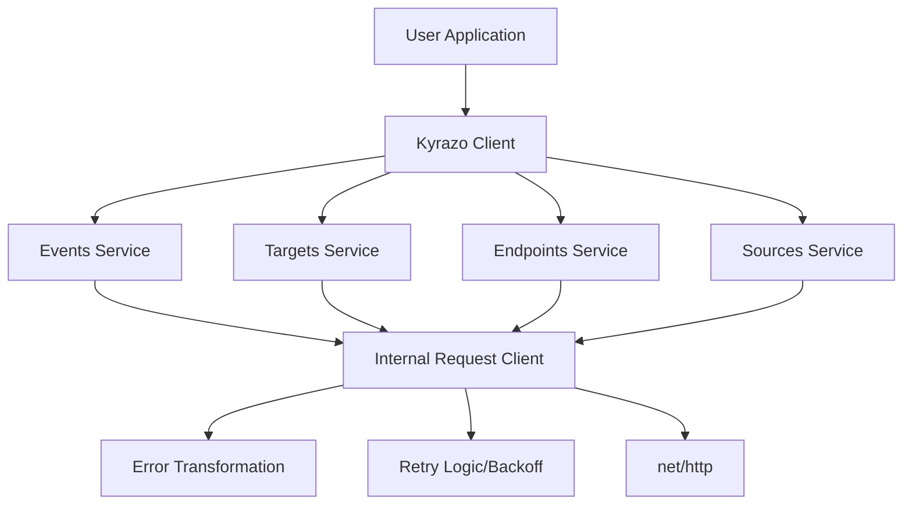

# Contributing to Kyrazo Go SDK

Welcome! This document provides an overview of the architecture, project structure, and guidelines for contributing to the Kyrazo Go SDK.

## Architecture

The SDK is designed with a layered, modular architecture to ensure testability and robustness.

### High-Level Design



### Components

1.  **Kyrazo Client (`client.go`)**: The main entry point. It orchestrates the initialization of service modules and the internal HTTP client.
2.  **Internal Request Client (`internal/request/client.go`)**: A low-level wrapper around `net/http`. This is the "brain" of the SDK, handling:
    - **Retries**: Exponential backoff on 5xx and 429 status codes.
    - **Idempotency**: Automatic `Idempotency-Key` generation.
    - **Global Headers**: Injection of `User-Agent` and `x-api-key`.
3.  **Service Modules**: Domain-specific logic (`events.go`, `targets.go`, etc.) that translate method calls into HTTP requests.
4.  **Error System (`models/apierrors/`)**: A rich hierarchy of errors that map to Kyrazo API codes.

## Project Structure

```text
sdks/go/
├── internal/
│   └── request/        # Robust HTTP client core & tests
├── models/
│   ├── apierrors/      # Rich error hierarchy & tests
│   └── schemas.go      # Request/Response structs
├── client.go           # Main SDK entry point
├── config.go           # Options pattern & defaults
├── events.go           # Events service module
├── targets.go          # Targets service module
├── endpoints.go        # Endpoints service module
├── sources.go          # Sources service module
├── README.md           # Full usage guide
└── CONTRIBUTING.md     # Architectural overview
```

## Development Workflow

### Prerequisites

- Go 1.22+
- `golangci-lint` (recommended)

### Testing

We maintain a high bar for testing. All logic in `internal/request` and the service modules must be covered by `httptest`-based unit tests.

```bash
# Run all tests
mise exec -- go test ./...

# Run tests with coverage
mise exec -- go test -v -cover ./...
```

### Code Style

- Follow idiomatic Go conventions (`effective go`).
- Use the functional options pattern for initialization.
- All exported methods must have a `context.Context` parameter as the first argument.
- Avoid external dependencies unless absolutely necessary.

## Pull Request Process

1.  **Open an Issue**: Discuss the proposed change before implementing it.
2.  **Add Tests**: Every fix or feature must include unit tests.
3.  **Documentation**: Update the `README.md` if the API surface changes.
4.  **Verify**: Ensure `go mod tidy` and `go build ./...` pass.

## License

By contributing, you agree that your contributions will be licensed under the MIT License.
