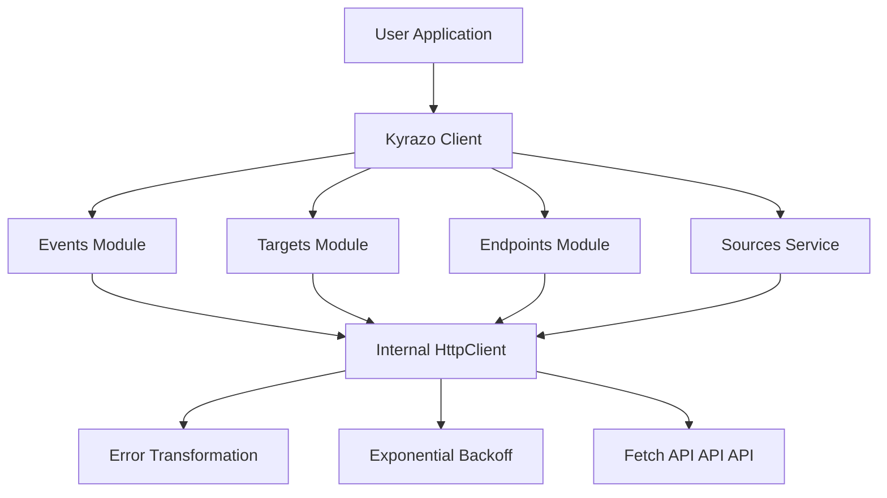

# Contributing to Kyrazo JavaScript SDK

Welcome! This document provides an overview of the architecture, project structure, and guidelines for contributing to the Kyrazo JavaScript SDK.

## Architecture

The SDK is designed with a layered, modular architecture to ensure testability and robustness across different JavaScript environments (Node.js, Browsers, Edge).

### High-Level Design



### Components

1.  **Kyrazo Client (`src/client.ts`)**: The main entry point. It orchestrates the initialization of service modules and the internal HTTP client.
2.  **Internal HttpClient (`src/utils/http.ts`)**: A low-level wrapper around the `fetch` API. This is the "brain" of the SDK, handling:
    - **Retries**: Automatic exponential backoff on 5xx and 429 status codes.
    - **Idempotency**: Automatic `Idempotency-Key` generation.
    - **Global Headers**: Injection of `User-Agent` and `x-api-key`.
3.  **Service Modules**: Domain-specific logic (`src/modules/`) that translates method calls into HTTP requests.
4.  **Error System (`src/errors.ts`)**: A rich hierarchy of errors that map to Kyrazo API codes.

## Project Structure

```text
sdk/javascript/
├── src/
│   ├── index.ts          # Main entry - exports everything
│   ├── client.ts         # Kyrazo client class
│   ├── modules/          # Service modules (Events, Targets, etc.)
│   ├── types/            # TypeScript definitions
│   ├── utils/            # HTTP client and helpers
│   └── errors.ts         # Error classes and mapping
├── test/                 # Vitest test suite
├── package.json          # Dependencies and scripts
└── tsconfig.json         # TypeScript configuration
```

## Development Workflow

### Prerequisites
- Node.js 18+
- `npm` or `pnpm`

### Testing
We maintain a high bar for testing. All logic in `HttpClient` and the service modules must be covered by unit tests.

```bash
# Run all tests
npm test

# Run tests with coverage
npm run test:coverage
```

### Code Style
- Follow standard JavaScript/TypeScript conventions.
- Use the functional factory pattern for service modules.
- Ensure all services support `AbortSignal` for request cancellation.

## Pull Request Process

1.  **Open an Issue**: Discuss the proposed change before implementing it.
2.  **Add Tests**: Every fix or feature must include unit tests.
3.  **Documentation**: Update the `README.md` if the API surface changes.
4.  **Verify**: Ensure `npm run build` and `npm run typecheck` pass.

## License

By contributing, you agree that your contributions will be licensed under the MIT License.
