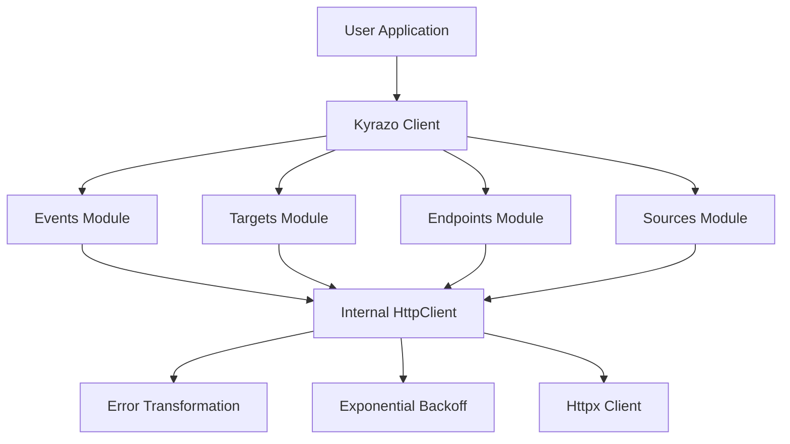

# Contributing to Kyrazo Python SDK

Welcome! This document provides an overview of the architecture, project structure, and guidelines for contributing to the Kyrazo Python SDK.

## Architecture

The SDK is designed with a layered, modular architecture to ensure testability and robustness across different environments.

### High-Level Design



### Components

1.  **Kyrazo Client (`kyrazo/client.py`)**: The main entry point. It orchestrates the initialization of service modules and the internal HTTP client.
2.  **Internal HttpClient (`kyrazo/core/http_client.py`)**: A low-level wrapper around the `httpx` library. This is the "brain" of the SDK, handling:
    - **Retries**: Manual exponential backoff loop for 5xx and 429 status codes.
    - **Idempotency**: Automatic `Idempotency-Key` generation for all mutation requests.
    - **Global Headers**: Injection of `User-Agent` and `Authorization`.
3.  **Service Modules (`kyrazo/resources/`)**: Domain-specific logic that translates method calls into HTTP requests.
4.  **Error System (`kyrazo/core/exceptions.py`)**: A rich hierarchy of Python exceptions that map to Kyrazo API codes.

## Project Structure

```text
sdk/python/
├── kyrazo/
│   ├── client.py         # Main entry - Kyrazo class
│   ├── core/             # Core logic (HTTP, Exceptions)
│   ├── resources/        # Service modules (Events, Targets, etc.)
│   └── models/           # Shared Pydantic models
├── tests/                # Pytest suite
├── pyproject.toml        # Dependencies and build system (Poetry)
└── README.md             # User-facing documentation
```

## Development Workflow

### Prerequisites
- Python 3.9+
- [Poetry](https://python-poetry.org/)

### Setup
```bash
poetry install
```

### Testing
We maintain a high bar for testing. All logic in `HttpClient` and the service modules must be covered by unit tests. We use `respx` for mocking HTTP requests.

```bash
# Run all tests
poetry run pytest

# Run tests with coverage
poetry run pytest --cov=kyrazo
```

### Code Style
- Use `ruff` for linting and formatting.
- Follow PEP 8 and use type hints consistently.
- All services should ideally support both synchronous and asynchronous (future) operations.

## Pull Request Process

1.  **Open an Issue**: Discuss the proposed change before implementing it.
2.  **Add Tests**: Every fix or feature must include unit tests.
3.  **Documentation**: Update the `README.md` if the API surface changes.
4.  **Verify**: Ensure `poetry run ruff check .` and `poetry run pytest` pass.

## License

By contributing, you agree that your contributions will be licensed under the MIT License.
